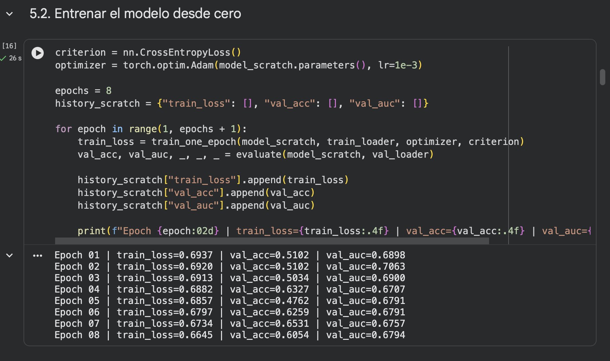
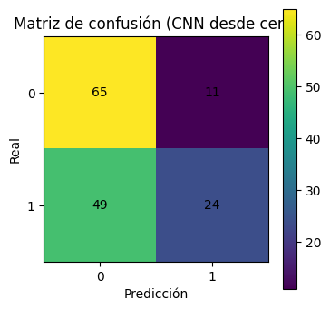
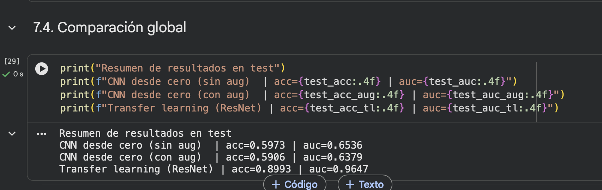
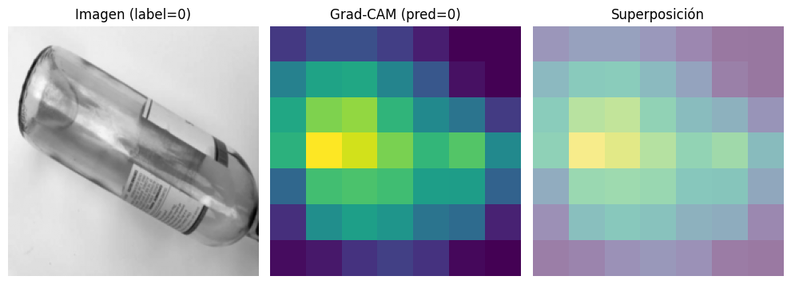
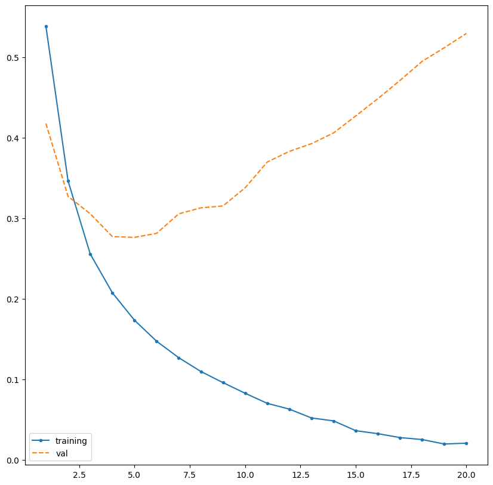
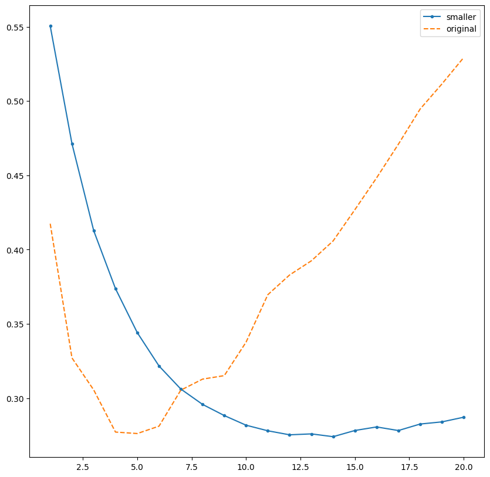
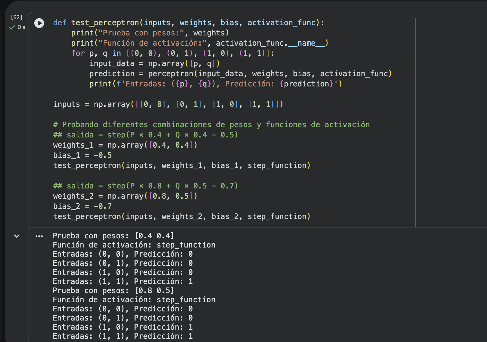
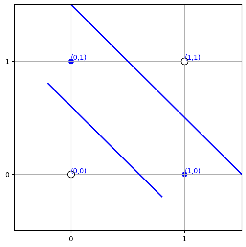

# Redes Neuronales: CNN, Keras y Perceptrón

---

## 1. CNN (PyTorch)

Una CNN analiza imágenes con filtros (*kernels*) que detectan patrones: bordes, texturas y formas. Sus capas principales son **Conv2D** (extrae características), **ReLU** (no linealidad), **MaxPool** (reduce tamaño) y **Dense** (clasifica).

**Caso:** TrashNet, clasificar imágenes en gris de vidrio (0) o plástico (1). 687 train / 147 validación / 149 test.

- **CNN desde cero:** la pérdida casi no baja (0.694 → 0.665) y el accuracy oscila entre 48% y 65%. Es **subajuste**: el modelo es muy simple y se entrenó pocas épocas.
- En test (59.7%) tiene **sesgo hacia vidrio**: clasifica 49 de 73 plásticos como vidrio.

- **Data augmentation** (rotaciones y traslaciones) no mejoró, porque sirve contra el sobreajuste y aquí el problema era el contrario.
- **Transfer learning (ResNet18):** se reutiliza un modelo preentrenado. Primero se entrena la última capa y luego se hace *fine-tuning* de `layer4`. Resultado: 89.9% de accuracy, solo 15 errores de 149.

**Conclusión:** con pocas imágenes, el transfer learning supera ampliamente a entrenar desde cero.

**Grad-CAM** muestra en qué zonas se fijó el modelo. Las zonas amarillas son las más influyentes: aquí el modelo se fija en la botella, no en el fondo.

---

## 2. Keras (clasificación binaria)

Keras permite armar redes con pocas líneas. **Caso:** reseñas de IMDB, negativa (0) o positiva (1). Cada reseña se convierte en un vector *one-hot* de 10 000 palabras.

Modelo: `Dense(16, relu) → Dense(16, relu) → Dense(1, sigmoid)`. La sigmoide da una probabilidad entre 0 y 1.

- El entrenamiento llega a 99.6% de accuracy, pero la validación se estanca en ~87%.
- La `val_loss` baja hasta la época 5 y luego sube: es **sobreajuste**. Convenía detener el entrenamiento ahí (*early stopping*).
- En test: **85.9%** de accuracy.

**Técnicas contra el sobreajuste:**

| Modelo | Mínimo val_loss | val_loss final | Resultado |
|---|---|---|---|
| Original (16-16) | 0.276 (época 5) | 0.529 | Sobreajuste fuerte |
| Más pequeño (4 neuronas) | 0.274 (época 14) | 0.287 | El mejor |
| L2 (0.001) | 0.332 (época 6) | 0.423 | Sube más lento, con picos |
| Dropout (0.5) | 0.275 (época 7) | 0.504 | Retrasa el sobreajuste |

**Predicción:** `predictions[10] = 0.9872` → reseña positiva con 98.7% de probabilidad.

> **Notas de revisión:** el cuaderno dice 99.4% y 86.1%, pero las salidas reales son 98.7% y 85.9%. Para decodificar la reseña hay que usar `word_index.get(x - 3)` por el `index_from=3`. En la gráfica de L2, la curva "train" es del modelo original.

---

## 3. Perceptrón

Es la neurona más simple: `salida = activación(w1·x1 + w2·x2 + bias)`. La función **escalón** devuelve 0 o 1; **tanh** devuelve un valor entre -1 y 1.

**Ejemplo de sobrecalentamiento:** temperatura = 100, vibración = 50, pesos [0.5, -0.5], bias -30. La suma es -5, así que el escalón da 0 y tanh da -0.9999: no hay alerta. Los pesos se fijaron a mano; en un caso real deben aprenderse de datos.

- Pesos [0.4, 0.4] y bias -0.5 → **AND**. Pesos [2, 1] y bias -0.5 → **OR**. Pesos [0.8, 0.5] y bias -0.7 → copia la entrada `p`.
- **XOR** no se puede separar con una sola recta. Un perceptrón no puede resolverlo, pero dos perceptrones y una capa de salida sí. Esa es la base de las redes multicapa.

---

## 4. Comparación

| | Perceptrón | Red densa (Keras) | CNN |
|---|---|---|---|
| Datos | Pocas variables numéricas | Datos tabulares o vectores | Imágenes |
| Relaciones | Solo lineales | No lineales | Patrones espaciales |
| Costo | Mínimo | Bajo–medio | Alto |

---

## 5. Pregunta: ¿cuál usaríamos en FISHMON 360?

FISHMON 360 es una boya que mide **pH, turbidez, conductividad, temperatura y oxígeno disuelto** en estanques de trucha y muestra alertas en un dashboard web.

- **CNN: no aplica**, porque el dispositivo no toma imágenes. Solo serviría si se agregara una cámara, por ejemplo para detectar peces enfermos.
- **Perceptrón: limitado.** Sirve para una alerta simple, pero solo capta relaciones lineales. Las variables del agua interactúan: el agua más caliente retiene menos oxígeno.
- **Red densa en Keras: la más adecuada.** Recibe las 5 mediciones y clasifica el estado del agua (óptimo / precaución / crítico). Usaríamos un modelo pequeño con Dropout y *early stopping* para evitar el sobreajuste.
